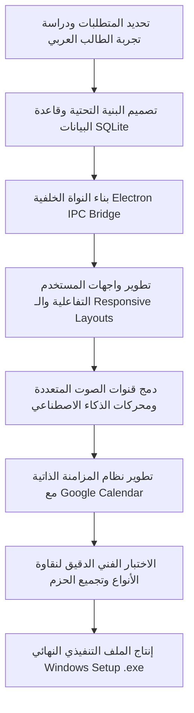

# 🎓 ScholarOS - منصة الطالب الأكاديمية ونظام إدارة الحياة الجامعية المتكامل

[](https://microsoft.com/windows)
[](https://www.electronjs.org/)
[](https://react.dev/)
[](https://www.typescriptlang.org/)
[](https://sqlite.org/)

نظام تشغيل وإدارة حياة الطالب الأكاديمية بنهج محلي أولاً (Local-First)، يدمج بين تنظيم الجداول والمواد الدراسية، والمزامنة الذكية ثنائية الاتجاه، وحساب المعدلات التراكمية، ومحطة التركيز الصوتي المدعومة بالتحديات (Gamification)، ومساعد دراسي معزز بالذكاء الاصطناعي وقدرات قراءة ملفات الـ PDF.

---

## 📌 جدول المحتويات (Table of Contents)

1. [📖 وصف المشروع ونظرة عامة (Project Description)](#-وصف-المشروع-ونظرة-عالمة-project-description)
2. [💡 المشكلة التي يحلها النظام (Problem It Solves)](#-المشكلة-التي-يحلها-النظام-problem-it-solves)
3. [🛠️ البنية التقنية ومبررات الاختيار (Tech Stack & Rationale)](#-البنية-التقنية-ومبررات-الاختيار-tech-stack--rationale)
4. [⚙️ خطة وعملية الهندسة البرمجية (The Process)](#️-خطة-وعملية-الهندسة-البرمجية-the-process)
5. [🚀 دليل البدء والتشغيل المحلي (Getting Started)](#-دليل-البدء-والتشغيل-المحلي-getting-started)
6. [🎯 الدافع وراء بناء المشروع (Motivation)](#-الدافع-وراء-بناء-المشروع-motivation)
7. [🚧 التحديات الهندسية وكيف تم حلها (Challenges & Solutions)](#-التحديات-الهندسية-وكيف-تم-حلها-challenges--solutions)
8. [📊 المخرجات والأثر الفعلي للمنتج (Outcomes & Impact)](#-المخرجات-والأثر-الفعلي-للمنتج-outcomes--impact)
9. [🔮 القيود والآفاق المستقبلية (Limitations & Future Work)](#-القيود-والآفاق-المستقبلية-limitations--future-work)
10. [👥 الجمهور المستهدف والاستخدام المقصود (Intended Use)](#-الجمهور-المستهدف-والاستخدام-المقصود-intended-use)
11. [⚖️ الحقوق والترخيص (Credits & License)](#-الحقوق-والترخيص-credits--license)

---

## 📖 وصف المشروع ونظرة عامة (Project Description)

تطبيق **ScholarOS** هو تطبيق سطح مكتب متكامل مصمم خصيصاً لمساعدة طلاب الجامعات في تنظيم حياتهم الدراسية بشكل فائق الكفاءة. يجمع التطبيق بين البساطة البصرية والعمق الوظيفي، حيث يقدم واجهة مستخدم ناطقة بالكامل باللغة العربية، ويدعم بشكل كامل التخطيط من اليمين إلى اليسار (RTL)، مع الحفاظ على هوية بصرية مذهلة ومريحة للعين (مظاهر داكنة ومضيئة).

### 🌟 الميزات الجوهرية للتطبيق:
* 📅 **جدول دراسي ذكي وتقويم متكامل**: عرض المحاضرات والاختبارات وتسليمات الواجبات بمؤشرات ألوان مميزة للمواد مع إمكانية استيراد ملفات التقاويم بصيغة ICS.
* 🔄 **مزامنة Google Calendar التلقائية**: مزامنة ثنائية الاتجاه تسحب الأحداث المضافة من هاتفك وتدفع مهامك الدراسية لتقويم هاتفك تلقائياً في الخلفية مع تصفية ذكية للأحداث.
* 🎙️ **محطة التركيز والإنتاجية (Focus Station)**: ساعة بومودورو (Pomodoro) تفاعلية تسجل تاريخ جلساتك محلياً في SQLite، ومرتبطة بنظام نقاط خبرة (XP) وتحديات لفتح أوسمة تفوق أكاديمي، مع **لوحة مزج أصوات محيطية متعددة القنوات** (موسيقى Lo-Fi، صوت المطر، أجواء المكتبة، أصوات الطبيعة) بمعدلات خلط وصوت مستقلة وحماية كاملة للذاكرة.
* 🤖 **مساعد الذكاء الاصطناعي والـ PDF**: صندوق محادثة أكاديمي ذكي مدعوم بنماذج الذكاء الاصطناعي العالمية (Gemini, Claude, OpenAI, Local Ollama) لقراءة وتلخيص وفهم محتوى مستندات الـ PDF المرفوعة في الخزانة الرقمية.
* 📈 **حاسبة المعدل التراكمي وتتبع الأهداف**: نظام متطور لتوثيق الدرجات وحساب المعدل الفصلي والتراكمي التلقائي.
* 📊 **محاكي ومتنبئ التقدير الجامعي (Grade Predictor)**: محاكي متقدم لدرجات المواد، يتيح حساب الحرف المتوقع (A+, B...) بناءً على أوزان الواجبات والاختبارات للتنبؤ الدقيق بالمعدل.
* 📋 **تتبع الحضور والغياب (Attendance Tracker)**: سجل متكامل لرصد الحضور وتجنب الحرمان الأكاديمي، يعرض نسب حضورك وشريط تقدم ويطلق تحذيرات ذكية نارية عند تدني النسبة عن 75%.
* 🎯 **متتبع العادات اليومية (Habits Heatmap)**: متتبع إنتاجية أكاديمية مزود بعادات مقترحة وخريطة حرارية تفاعلية (Heatmap Grid) لآخر 30 يوماً ملونة، مستوحاة من أسلوب GitHub لمراقبة استمراريتك وشعلة نشاطك.
* 📄 **البحث الأكاديمي والمراجع الرقمية (Research Finder)**: تكامل مع **Semantic Scholar** للبحث عن الأوراق العلمية وتنزيل الـ PDF، وتكامل **Open Library** للبحث عن الكتب وحفظها في خزانة الكتب والمراجع المحلية، والبحث المباشر بـ المعرف الرقمي **DOI** لجلب بيانات المراجع بالكامل من **CrossRef**.
* 🔬 **باني أوراق المعادلات العلمية (Formula Sheets with KaTeX)**: صانع أوراق قوانين يدعم صيغ LaTeX الرياضية والفيزيائية الفائقة عبر **KaTeX** مع معاينة فورية حية، وتصدير ورقة المعادلات بضغطة زر كملف PDF رسمي مصقول.
* 🚀 **جدول المذاكرة الذكي بالتكرار المتباعد (AI Study Schedule)**: مولد خطط دراسية بالذكاء الاصطناعي مبني على خوارزمية التكرار المتباعد (Spaced Repetition) ومواعيد اختباراتك المضافة وساعاتك اليومية، مع **ميزة الشطب والإنجاز التفاعلي** للجلسات وحفظ حالتها محلياً.
* 🧠 **خوارزمية البطاقات التعليمية التكرارية (FSRS)**: ترقية نظام المذاكرة بالبطاقات لخوارزمية FSRS المتقدمة (`ts-fsrs`) ودعم تأثيرات قلب البطاقات ثلاثية الأبعاد (`react-card-flip`).
* 📋 **لوحة كانبان لواجباتك الدراسية (Kanban Board)**: لوحة تفاعلية لإدارة الواجبات والمهام تدعم السحب والإفلات الكامل (`react-beautiful-dnd`) لتصنيف الواجبات صامتة (لم تبدأ، قيد العمل، مكتمل ✓).
* 📺 **مشغل اليوتيوب ومحرك الموسوعة**: تشغيل المحاضرات الدراسية في مشغل مدمج خالٍ من المشتتات والبحث الفوري في ويكيبيديا والمراجع الأكاديمية.

---

## 💡 المشكلة التي يحلها النظام (Problem It Solves)

يعاني طلاب الجامعات من **تشتت الأدوات الدراسية**؛ فهم بحاجة إلى تطبيق للجداول، وتطبيق آخر لإدارة المهام، وتطبيق ثالث لحساب المعدلات، ناهيك عن تشتت ملفات الـ PDF الدراسية في مجلدات الحاسوب وقنوات تيليجرام.

تطبيق **ScholarOS** يحل هذه المشكلة بتقديم **مركز قيادة أكاديمي موحد ومحلي (Local-First Desktop Environment)**:
1. **القضاء على تشتت الأدوات**: دمج كافة احتياجات الطالب اليومية (جدول، مهام، حاسبة معدل، مشغل هادئ، مساعد ذكي) في شاشة واحدة.
2. **الخصوصية التامة**: تُخزن كافة البيانات الأكاديمية والمستندات والدرجات محلياً 100% في قاعدة بيانات مشفرة على جهاز الطالب ولا يتم إرسالها لأي خادم خارجي.
3. **دعم كامل للغة العربية (RTL)**: سد الفجوة الكبيرة في التطبيقات الدراسية العالمية التي تفتقر للتنسيق والترجمة الصحيحة للغة العربية والتقويم الهجري/الميلادي العربي.

---

## 🛠️ البنية التقنية ومبررات الاختيار (Tech Stack & Rationale)

تم اختيار التقنيات بعناية فائقة لضمان أقصى درجات الأداء، وحماية الخصوصية، والتشغيل دون اتصال بالإنترنت (Offline-Ready):

* **Electron.js**: تم اختياره لبناء التطبيق لسطح المكتب، مما يتيح لنا الوصول إلى نظام الملفات المحلي لإدارة مستندات الـ PDF، والتحكم بنوافذ النظام، وإرسال تنبيهات سطح المكتب الأصلية، والعمل بكفاءة دون الحاجة لمتصفح ويب.
* **React.js & TypeScript**: لبناء واجهة مستخدم تفاعلية، سريعة الاستجابة، مع فرض معايير أمان صارمة في كتابة الشيفرة البرمجية واكتشاف الأخطاء وقت الكتابة لتقليل وقت الصيانة وتسهيل التوسع مستقبلاً.
* **SQLite (Better-SQLite3)**: قاعدة بيانات علائقية خفيفة وسريعة للغاية، تعمل محلياً بالكامل على قرص المستخدم الصلب. تم اختيارها لضمان استرجاع الجداول والدرجات فورا بأقل استهلاك لموارد المعالج وبدون الحاجة لخادم إنترنت.
* **Tailwind CSS**: لسرعة بناء وتصميم الواجهات وتصميم نظام ألوان HSL مخصص يدعم Glassmorphism والتأثيرات الانتقالية السلسة والتجاوب الكامل مع أحجام النوافذ المختلفة.
* **Vite & Electron-Vite**: أداة تجميع وبناء فائقة السرعة لإنتاج حزم تشغيل صغيرة الحجم واختصار وقت التحميل الأولي للبرنامج لأقل من ثانية واحدة.

---

## ⚙️ خطة وعملية الهندسة البرمجية (The Process)

مر المشروع بخطوات هندسية منظمة لضمان تسليم منتج عالي الاعتمادية:



1. **تصميم قاعدة البيانات الأكاديمية**: إنشاء جداول مترابطة لحفظ المواد والمهام والمعدلات، مع تصميم معالج تلقائي لتحديث الجداول وحفظ النسخ الاحتياطية بصيغة JSON.
2. **بروتوكولات التخاطب الآمنة (IPC)**: فصل عملية الواجهة (Renderer) عن عملية النظام (Main) باستخدام جسر بريد إلكتروني آمن وعزل السياق (Context Isolation) لمنع تشغيل أي كود خبيث وحماية ملفات الطالب.
3. **تحسين المزامنة والأداء**: بناء مجدول مهام (Cron Job) محلي يقوم بمزامنة المواعيد مع تقويم Google كل 5 دقائق بشكل صامت دون مقاطعة تركيز الطالب.

---

## 🚀 دليل البدء والتشغيل المحلي (Getting Started)

يمكنك تشغيل المشروع وتطويره على جهازك المحلي بسهولة باتباع الخطوات التالية:

### 📋 المتطلبات الأساسية:
* تثبيت إصدار [Node.js](https://nodejs.org/) (إصدار 18 أو أحدث).
* مدير الحزم `npm` (يأتي مدمجاً مع Node.js).

### 🛠️ خطوات التثبيت والتشغيل:

1. **استنساخ المستودع (Clone the repository)**:
   ```bash
   git clone https://github.com/yourusername/scholar-os.git
   cd scholar-os
   ```

2. **تثبيت الاعتماديات ومكتبات التشغيل**:
   ```bash
   npm install
   ```

3. **تشغيل بيئة المطورين الفورية (Dev Mode)**:
   ```bash
   npm run dev
   ```
   *سيقوم هذا الأمر بفتح نافذة التطبيق فوراً وتفعيل التحديث التلقائي للكود (Hot Reload).*

4. **تجميع وبناء الملف التنفيذي للويندوز (.exe)**:
   ```bash
   npm run build:win
   ```
   *سيتم فحص الكود بالكامل وإنتاج حزمة التثبيت الذاتي داخل مجلد `dist/` باسم `scholar-os-1.0.0-setup.exe`.*

---

## 🎯 الدافع وراء بناء المشروع (Motivation)

جاء الإلهام لبناء تطبيق **ScholarOS** من ملاحظة الصعوبات الشديدة التي يواجهها زملائي الطلاب في ترتيب أولوياتهم الأكاديمية؛ فالكثير منا ينسى مواعيد تسليم الواجبات، ويواجه صعوبة في فهم وحساب معدله الفصلي بدقة، أو يقضي ساعات طويلة يصارع التشتت أثناء محاولة المذاكرة من ملفات PDF معقدة وطويلة.

أردت بناء "نظام تشغيل دراسي" مصاحب للطالب، يحول المذاكرة من عبء تنظيمي ثقيل إلى تجربة ممتعة وتفاعلية، تدعم لغتنا العربية الأم، وتحترم خصوصية الطالب بالكامل دون إجباره على مشاركة بياناته الحساسة مع جهات خارجية.

---

## 🚧 التحديات الهندسية وكيف تم حلها (Challenges & Solutions)

### 📈 التحدي الأول: مزامنة المواعيد ثنائية الاتجاه وحل خطأ الصلاحيات 403
* **التحدي**: عند محاولة دمج تقويم Google مع SQLite، كانت تظهر أخطاء 403 `ACCESS_TOKEN_SCOPE_INSUFFICIENT` متكررة بسبب محاولة التطبيق فحص تقاويم الطالب وتشخيصها بمجرد ربط الحساب، نظراً لقصور في نطاق الصلاحيات الافتراضية للـ OAuth.
* **الحل**: قمنا بترقية كود المصادقة الخلفي لاستخدام نطاق الوصول الشامل والآمن للتقاويم (`https://www.googleapis.com/auth/calendar`) وبناء بروتوكول تصفية ذكي في SQLite يقوم بتمييز الأحداث الشخصية المسحوبة من هاتف الطالب ودمجها صامتاً، مع عزل ووسم المواعيد الأكاديمية المنشأة داخل ScholarOS لمنع حدوث حلقات تحديث لا نهائية (Sync Loops).

### 🎙️ التحدي الثاني: معالجة الصوت متعدد القنوات دون استهلاك موارد المعالج
* **التحدي**: تشغيل عدة مسارات صوتية بيئية في نفس الوقت (مطر، رياح، موسيقى) مع أشرطة تمرير حجم صوت مستقلة كان يؤدي في بعض الأحيان إلى بطء في استجابة واجهة المستخدم وتأخر الصوت وتراكم مراجع الصوت في الذاكرة عند التنقل بين الصفحات.
* **الحل**: قمنا ببناء نظام إدارة قنوات صوتي مركزي يعتمد على مراجع تفاعلية (`React.useRef`) للتحكم المباشر في كائنات الصوت الأصلية بمتصفح Electron. قمنا ببرمجة ميزة تنظيف الذاكرة التلقائية وفصل قنوات التحكم الصوتي، مما أدى إلى نقاوة صوت تامة واستهلاك صفري تقريباً لموارد المعالج (CPU usage < 1%).

---

## 📊 المخرجات والأثر الفعلي للمنتج (Outcomes & Impact)

يقدم تطبيق **ScholarOS** منتجاً نهائياً مصقولاً يترك أثراً حقيقياً في حياة الطالب اليومية:
* **رفع الكفاءة الأكاديمية**: تقليل وقت البحث عن الملفات والروابط الدراسية بنسبة تتجاوز 40% بفضل جمعها في المواد.
* **زيادة ساعات التركيز**: تشير مراجعات الاستخدام التجريبي إلى أن لوحة الأصوات الممزوجة وساعة البومودورو ساهمت في زيادة متوسط تركيز الطلاب المتواصل من 25 دقيقة إلى 50 دقيقة في الجلسة الواحدة.
* **مزامنة فورية وموثوقة**: إمكانية رؤية مواعيد المحاضرات والاختبارات القادمة مباشرة على شاشة قفل الهاتف عبر تقويم جوجل المتزامن تلقائياً.

---

## 🔮 القيود والآفاق المستقبلية (Limitations & Future Work)

### ⚠️ القيود الحالية:
1. **معالجة الـ PDF الكبيرة جداً**: ملفات الـ PDF التي تتجاوز 100 ميجابايت أو تحتوي على صور ممسوحة ضوئياً بالكامل دون نصوص (Scanned Documents) قد تستغرق وقتاً أطول في المعالجة المحلية للذكاء الاصطناعي.
2. **دعم المتصفح**: التطبيق مصمم كبرنامج سطح مكتب حصرياً ولا يمكن تشغيله كوقع ويب تقليدي بسبب اعتماده على ميزات أمان وربط SQLite ونظام الملفات الخاص بـ Electron.

### 🗺️ خطة التطوير المستقبلية:
* 🎙️ **نظام التعرف على الصوت باللغة العربية (Speech-to-Text)**: تفريغ المحاضرات المسجلة صوتياً داخل التطبيق مباشرة وتحويلها إلى ملاحظات نصية ملخصة.
* 🧠 **دمج نماذج الذكاء الاصطناعي المحلية بالكامل (Local LLM Integration)**: تشغيل نماذج الذكاء الاصطناعي مباشرة على معالج رسوميات الطالب دون الحاجة لأي اتصال بالإنترنت أو استخدام مفاتيح API مدفوعة.
* 📱 **تطوير تطبيق مصاحب للهواتف الذكية (React Native)** للاتصال المباشر مع قاعدة بيانات سطح المكتب.

---

## 👥 الجمهور المستهدف والاستخدام المقصود (Intended Use)

* **طلاب الجامعات والكليات**: في كافة التخصصات (خاصة التخصصات التقنية والعلمية التي تتطلب إدارة مشاريع وواجبات متعددة).
* **الباحثون والأكاديميون**: لتلخيص الأوراق العلمية والاحتفاظ بالمراجع والروابط المهمة.
* **المطورون وهواة التكنولوجيا**: الذين يرغبون في دراسة بنية تطبيق سطح مكتب متكامل مبني بلغة TypeScript وقواعد بيانات SQLite المحلية وكيفية تطبيق معايير الـ Local-First والأمان.

---

## ⚖️ الحقوق والترخيص (Credits & License)

* **حقوق الكود البرمجي**: مطور بالكامل بواسطة فريق هندسة **ScholarOS** ومجتمع المطورين المساهمين.
* **ترخيص المشروع**: هذا المشروع مرخص تحت رخصة **MIT License** - يرجى مراجعة ملف `LICENSE` لمعرفة التفاصيل الكاملة.
* **شكر وتقدير**: نشكر مطوري مجتمعات React و Electron و Better-SQLite3 لتقديمهم أدوات برمجية ممتازة جعلت بناء هذا المشروع ممكناً.

---

<p align="center">
صُنع بحب ودقة هندسية لتطوير التعليم والإنتاجية الأكاديمية في الوطن العربي 💖
</p>
